<div align="center">

# snaptranslate — Point, Snap, Translate: An OCR Travel Translator

**snaptranslate is an OCR translator for travellers who need to read signs, menus and notices in another language. It takes a photo or a text through these steps to a labelled translation:**

`prepare image` → `OCR with the right pack` → `detect language` → `route to a backend` → `label the result`.


**[Summary](#1-summary)** ·
**[Workflow](#4-the-end-to-end-workflow)** ·
**[Run it](#10-how-to-run-snaptranslate)** ·
**[Configuration](#104-environment-variables)** ·
**[Known problems](#13-known-problems)** ·
**[Glossary](#15-glossary)**

</div>

> [!NOTE]
> This README uses ASD-STE100 Simplified Technical English. The writing rules and the project
> vocabulary are in [`docs/ste-style-guide.md`](docs/ste-style-guide.md). Each term in the
> [Glossary](#15-glossary) has only one meaning.

---

snaptranslate reads a photo with the Tesseract pack of the source language and detects the language with normalised codes.
It then sends the text to the first backend that supports the pair.
The main idea is an honest result. Each result has a status, so the user always knows if the output is a translation, an approximation or no translation.
The project also has an offline benchmark that scores each backend against the reference translation of each sentence.
All of it runs offline with a small glossary backend. MarianMT, NLLB-200 and an LLM API are optional.

This README is the **one location that explains all of snaptranslate**. It gives these topics:

- the general design
- each component and its procedure, step by step
- the decision rules
- the data map
- the runbook
- the validation results and the known problems

| If you are… | Read |
|---|---|
| A manager or reviewer | [1](#1-summary), [3](#3-design-rules), [4](#4-the-end-to-end-workflow), [12](#12-validation-results), [14](#14-key-points) |
| A developer who joins the project | All sections, in sequence. Keep [10](#10-how-to-run-snaptranslate) and [13](#13-known-problems) open while you work |
| An operator who runs snaptranslate | [10](#10-how-to-run-snaptranslate), then the section for the component that you use |

---

## Table of contents

1. 🧭 [Summary](#1-summary)
2. 🏗️ [How snaptranslate is built](#2-how-snaptranslate-is-built)
   - 2.1 [Components](#21-components)
   - 2.2 [System context](#22-system-context)
   - 2.3 [Repository layout](#23-repository-layout)
3. 🛡️ [Design rules](#3-design-rules)
4. 🔄 [The end-to-end workflow](#4-the-end-to-end-workflow)
   - 4.1 [Full flow](#41-full-flow)
   - 4.2 [The life cycle of one photo](#42-the-life-cycle-of-one-photo)
   - 4.3 [Who does which step](#43-who-does-which-step)
5. 🔵 [OCR and language identification](#5-ocr-and-language-identification)
6. 🟢 [The router and the backends](#6-the-router-and-the-backends)
7. 🟣 [The offline benchmark](#7-the-offline-benchmark)
8. ⚖️ [The decision rules](#8-the-decision-rules)
9. 🗂️ [Data and file map](#9-data-and-file-map)
10. ▶️ [How to run snaptranslate](#10-how-to-run-snaptranslate)
    - 10.1 [Prerequisites](#101-prerequisites) · 10.2 [Installation](#102-installation) · 10.3 [Run snaptranslate](#103-run-snaptranslate) · 10.4 [Environment variables](#104-environment-variables)
11. 🧩 [How to extend snaptranslate](#11-how-to-extend-snaptranslate)
12. ✅ [Validation results](#12-validation-results)
13. ⚠️ [Known problems](#13-known-problems)
14. 📌 [Key points](#14-key-points)
15. 📖 [Glossary](#15-glossary)
16. 📄 [License](#16-license)

---

## 1. Summary

**The problem.** A traveller takes a photo of a sign and wants to know what it says. These questions are difficult:

- Which OCR language pack reads the accents of the sign correctly?
- Which language is the text in, when each tool uses a different code?
- Which model translates this pair, and what happens when no model does?
- How do you keep secrets, camera access and history safe in a web app?
- How do you measure translation quality in a fair way?

snaptranslate gives each of these questions its own component. Each component has a typed result and unit tests.

| Item | Value |
|---|---|
| Input | A text, or a photo from the browser camera or a file |
| Output | A `TranslationResult` with a status, the backend, the coverage and a message |
| Components | **16** modules plus the Streamlit page: config, languages, langid, preprocess, ocr, mt/base, mt/neural, mt/llm_api, mt/glossary, mt/router, history, pipeline, metrics, synthetic, benchmark, cli |
| Providers | MarianMT (28 pairs), NLLB-200 (all 16 languages), any OpenAI-compatible LLM API. All are optional |
| Offline mode | Built-in detector, glossary backend (de, fr, es, it to English), benchmark. No key and no network |
| Safety | No secret in code. No installer, no subprocess, no server camera. History stays in one session |
| Tests | **75** unit tests pass in CI (`pytest`), 1 skips without the `metrics` extra (`sacrebleu`) |

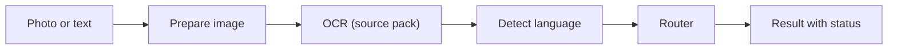

---

## 2. How snaptranslate is built

### 2.1 Components

| Component | Module | Purpose |
|---|---|---|
| Settings | `src/snaptranslate/config.py` | Pydantic settings from environment variables, secret as `SecretStr` |
| Language registry | `src/snaptranslate/languages.py` | 16 languages, canonical codes, Tesseract, NLLB and Marian codes |
| Detector | `src/snaptranslate/langid.py` | Script ranges plus a character n-gram naive Bayes model |
| Image preparation | `src/snaptranslate/preprocess.py` | Gray, upscale, contrast, Otsu threshold (NumPy only) |
| OCR | `src/snaptranslate/ocr.py` | Pack selection, two-pass reading, `TesseractOCR`, `ScriptedOCR` |
| Backend interface | `src/snaptranslate/mt/base.py` | `Translator`, `TranslationResult`, `ModelCache` |
| Neural backends | `src/snaptranslate/mt/neural.py` | `MarianTranslator`, `NLLBTranslator` (lazy imports) |
| LLM backend | `src/snaptranslate/mt/llm_api.py` | OpenAI-compatible chat API at temperature 0 |
| Glossary backend | `src/snaptranslate/mt/glossary.py` | Offline phrase and word lookup with coverage |
| Router | `src/snaptranslate/mt/router.py` | Backend selection, fallback, status labels |
| Session history | `src/snaptranslate/history.py` | Bounded history in memory for one session |
| Pipeline | `src/snaptranslate/pipeline.py` | `SnapTranslate`: OCR, detection, routing, history |
| Metrics | `src/snaptranslate/metrics.py` | BLEU, chrF, CER, WER, bootstrap intervals |
| OCR noise | `src/snaptranslate/synthetic.py` | Synthetic noise of a wrong or a correct pack |
| Benchmark | `src/snaptranslate/benchmark.py` | Test set loader, `CopySource` baseline, scores |
| CLI | `src/snaptranslate/cli.py` | The `snaptranslate` command with 7 subcommands |
| Streamlit page | `src/snaptranslate/app/streamlit_app.py` | Browser camera, upload, text, session history |

The component map shows which module calls which module. An arrow points from the caller to the module that it uses.

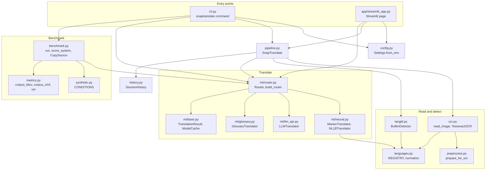

### 2.2 System context

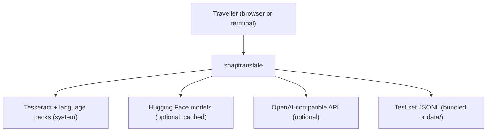

### 2.3 Repository layout

```
snaptranslate/
├── .github/workflows/ci.yml       # CI: Python 3.11, pip install -e ".[dev]", pytest -q
├── Dockerfile                     # Python 3.11 + Tesseract + 12 language packs
├── data/README.md                 # test set format, FLORES-200 instructions (data files are git-ignored)
├── docs/ste-style-guide.md        # writing rules and project vocabulary
├── src/snaptranslate/
│   ├── mt/                        # backends and router
│   ├── app/streamlit_app.py       # optional browser page
│   ├── data/                      # synthetic test set, glossary, detector samples
│   └── ...                        # the other modules in 2.1
├── tests/                         # 76 unit tests, no network (1 needs sacrebleu)
├── .env.example                   # variable names only
└── pyproject.toml                 # core deps: numpy, pydantic. Extras: ocr, mt, langdetect, metrics, ui, dev
```

---

## 3. Design rules

### 3.1 No secret in the code
The LLM key comes only from `SNAPTRANSLATE_LLM_API_KEY`. `Settings` keeps it as a `SecretStr`, and `LLMTranslator` hides it in its repr and in each error. A test scans the repository for key patterns.

### 3.2 An honest status for each result
The router never shows the source text as a translation. If no backend supports the pair, the status is `unsupported_pair` and the text is empty. Glossary output has the status `approximate` and a coverage value.

### 3.3 The correct OCR pack
The OCR reads with the pack of the source language plus English. If the source language is not known, a first pass with Latin packs finds the language, and a second pass reads with its pack.

### 3.4 One code for each language
`languages.normalize` maps `zh-cn`, `chi_sim`, `zho_Hans` and `Chinese` to `zh`. Thus the detector, the OCR packs and the model names always agree.

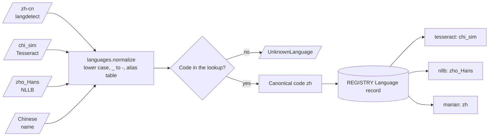

### 3.5 Fair and reproducible scores
The benchmark scores each output against the reference of the same sentence. The neural backends decode with no sampling, and the LLM backend uses temperature 0. The metrics give the same values as `sacrebleu` 2.x.

### 3.6 One app, no subprocess, client camera
The source code has no `os.system`, no `subprocess` and no `cv2.VideoCapture`. Tests check this. The page uses `st.camera_input`, so the photo comes from the camera of the user.

### 3.7 Models load once
`ModelCache` keeps loaded models in an LRU store. The Streamlit page keeps the router in `st.cache_resource`, so a click does not load a model again.

### 3.8 Private history
Each session has its own `SessionHistory` in memory. snaptranslate writes no history file. `export_json` writes a file only when the user asks.

---

## 4. The end-to-end workflow

### 4.1 Full flow

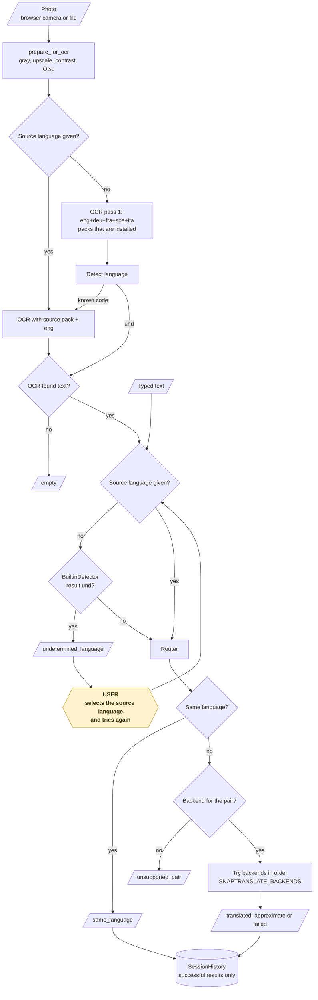

### 4.2 The life cycle of one photo

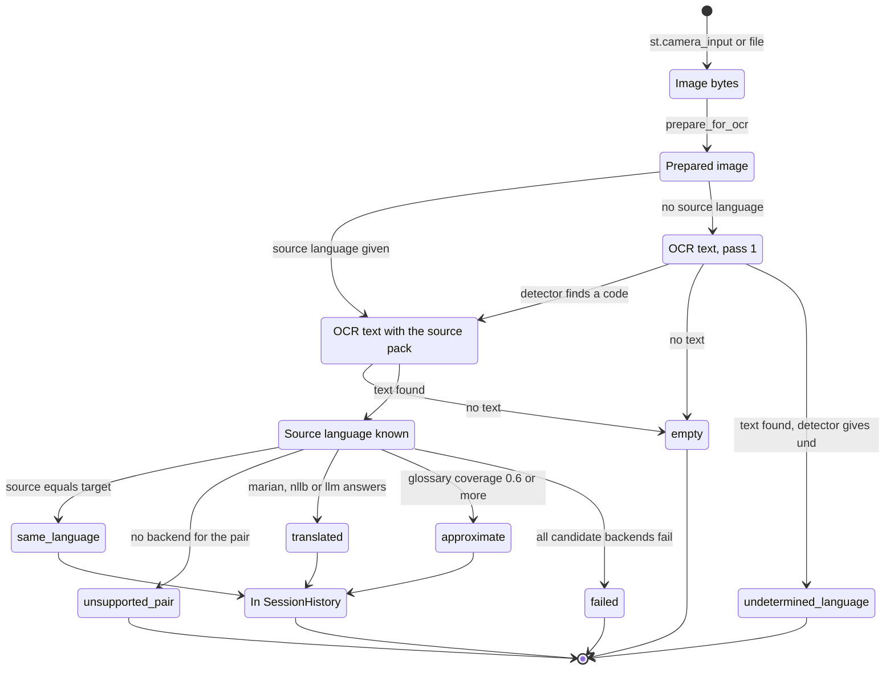

1. The browser camera takes the photo and sends the image bytes.
2. The OCR engine changes the image to gray, upscales it, stretches the contrast and binarises it.
3. If the user selected a source language, the OCR reads with its pack.
4. If not, the OCR reads with the Latin packs, and the detector finds the language.
5. The OCR reads again with the pack of the detected language.
6. The router finds the first available backend that supports the pair.
7. If that backend fails, the router tries the next one.
8. The pipeline returns the result with its status, backend, coverage and message.
9. If the status is successful, the session history stores the result.

### 4.3 Who does which step

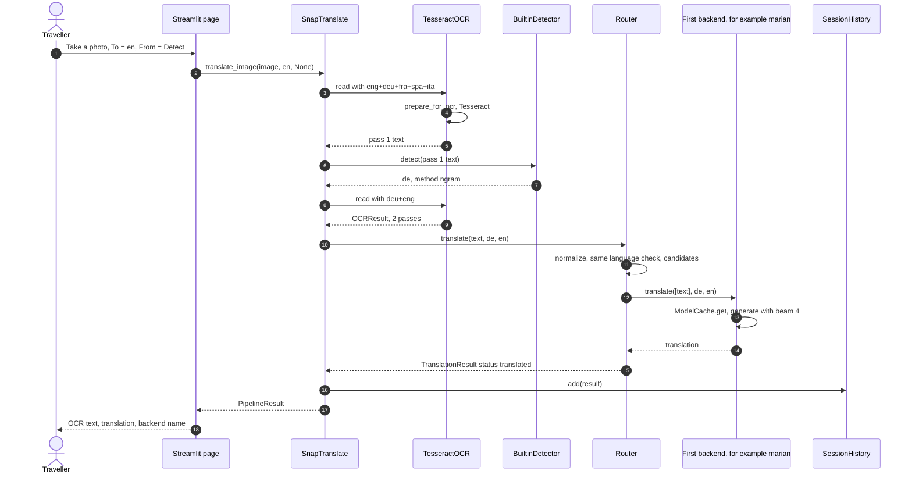

---

## 5. OCR and language identification

**Purpose.** Get the correct text from a photo and find its language.

`ocr.read_image` selects the packs and reads one or two times:

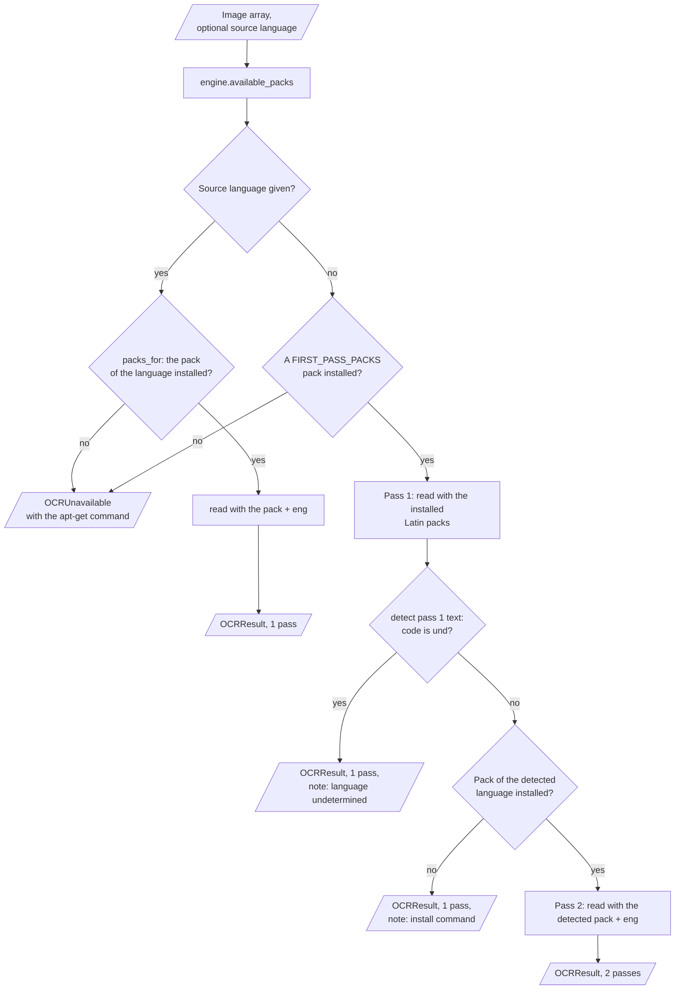

Each read prepares the image first (`preprocess.prepare_for_ocr`):

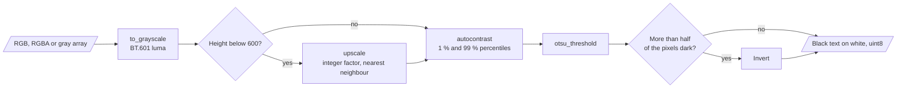

| Input | Output |
|---|---|
| Image array, optional source language | `OCRResult` (text, confidence, packs, passes, notes) and a `Detection` |

**Procedure**

1. Prepare the image: BT.601 gray, upscale to 600 pixels high or more, 1 % to 99 % contrast stretch, Otsu binarisation.
2. If most pixels are dark, invert the image, so the text is black on white.
3. Select the packs with `packs_for`. If a pack is missing, raise `OCRUnavailable` with the `apt-get` command.
4. Read the image with Tesseract and calculate the mean word confidence.
5. Detect the language of the text.

**Rules for the detector**

| Script in the text | Result |
|---|---|
| Any Kana | `ja` |
| Mostly Hangul | `ko` |
| Mostly Han | `zh`, or `zh-Hant` if more traditional than simplified marker characters |
| Mostly Cyrillic, Arabic or Devanagari | `ru`, `ar` or `hi` |
| Mostly Latin | Naive Bayes over character 1-3 grams for `en`, `de`, `fr`, `es`, `it`, `pt`, `nl`, `tr`, `pl` |
| Fewer than 3 letters | `und` (method `too-short`) |
| Naive Bayes confidence below 0.5 | `und` (method `ngram-low-confidence`) |

If the result is `und`, the pipeline asks the user to select the source language. `LangdetectDetector` is an optional alternative with the same normalised codes.

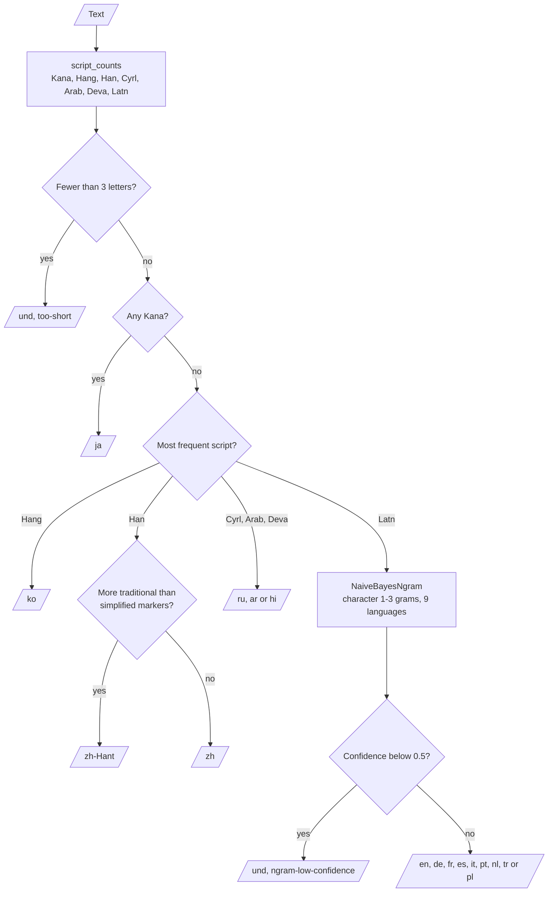

---

## 6. The router and the backends

**Purpose.** Translate with the best available backend and label the result.

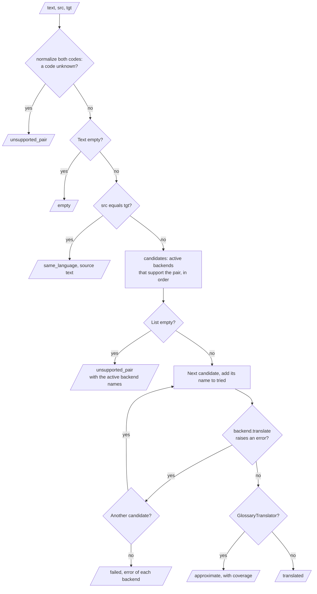

| Input | Output |
|---|---|
| Source text, source language, target language | `TranslationResult` |

**Procedure**

1. Normalise both language codes.
2. If the text is empty, return `empty`.
3. If both codes are equal, return `same_language` with the source text.
4. List the available backends that support the pair, in the order of `SNAPTRANSLATE_BACKENDS`.
5. If the list is empty, return `unsupported_pair` with the names of the active backends.
6. Call each backend in turn until one succeeds. Record each attempt in `tried`.
7. If all fail, return `failed` with the error of each backend.

**Backends**

| Backend | Pairs | Decoding | Status of output | Extra |
|---|---|---|---|---|
| `marian` | 28 Helsinki-NLP `opus-mt` pairs (`MARIAN_PAIRS`) | beam 4, no sampling | `translated` | `mt` |
| `nllb` | All 16 languages, many-to-many | beam 4, no sampling | `translated` | `mt` |
| `llm` | All 16 languages | temperature 0 | `translated` | none (needs a key) |
| `glossary` | de, fr, es, it to English | phrase, then word lookup | `approximate` | none |

`build_router` makes the backends in the order of `SNAPTRANSLATE_BACKENDS`. Each backend is active only when its check passes:

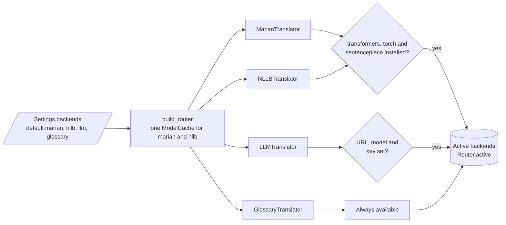

**Rules**

- A backend is active only if its packages are installed (or, for `llm`, if the URL, model and key are set).
- The glossary refuses a sentence when it knows less than 60 % of the words.
- The glossary marks an unknown word as `[word]`. It copies a capital word inside a sentence, but this word does not count as known.
- Traditional Chinese uses the `opus-mt-zh-en` model, because there is no separate Marian model for it.

The glossary backend (`GlossaryTranslator.gloss`) makes one approximate sentence:

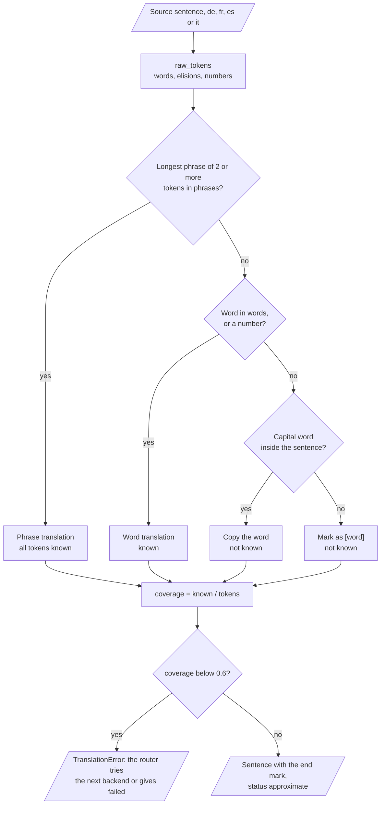

---

## 7. The offline benchmark

**Purpose.** Measure each backend on sentences with known references, also with OCR noise.

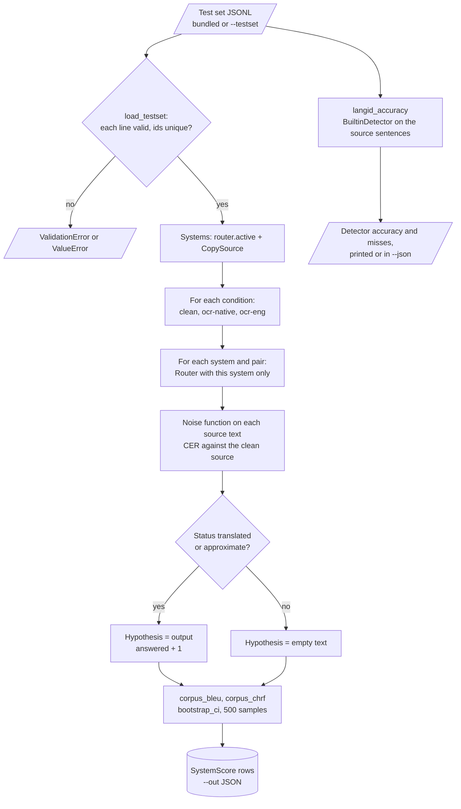

| Input | Output |
|---|---|
| Test set JSONL, backends, conditions | One `SystemScore` row for each system, condition and pair |

**Procedure**

1. Load and validate the test set (`id`, `src_lang`, `tgt_lang`, `src`, `ref`, unique ids).
2. Add the `CopySource` baseline to the active backends.
3. For each condition, change each source text with the noise function.
4. Translate each sentence with one system through the router.
5. Use an empty output for each item that the system does not answer.
6. Calculate corpus BLEU and chrF with 95 % bootstrap intervals (500 samples).
7. Calculate the detector accuracy on the source sentences.

**Conditions**

| Condition | What it does to the source text |
|---|---|
| `clean` | Nothing |
| `ocr-native` | 1 % random character errors (the correct pack) |
| `ocr-eng` | Accents lost or changed (`ü` to `u` or `ti`, `ñ` to `n` or `fi`, `¿` removed) plus 1 % random errors (the English pack) |

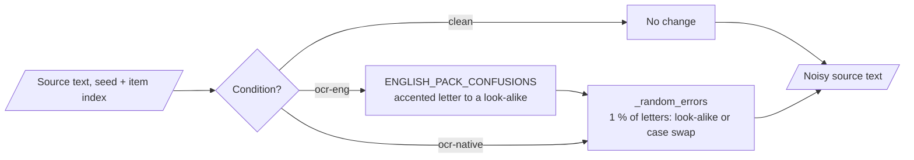

---

## 8. The decision rules

**Status values**

| Status | Meaning | Text field | Stored in history |
|---|---|---|---|
| `translated` | A neural or LLM backend translated the text | Translation | Yes |
| `approximate` | The glossary gave a word-by-word output | Approximation | Yes |
| `same_language` | Source and target are the same language | Source text | Yes |
| `unsupported_pair` | No active backend supports the pair, or the router gets an unknown code | Empty | No |
| `undetermined_language` | The detector gave `und` and the user gave no source language, or the user gave an unknown source code | Empty | No |
| `failed` | All candidate backends failed | Empty | No |
| `empty` | No text, or OCR found no text | Empty | No |

`SnapTranslate` stores a result in the session history only when `TranslationResult.ok` is true:

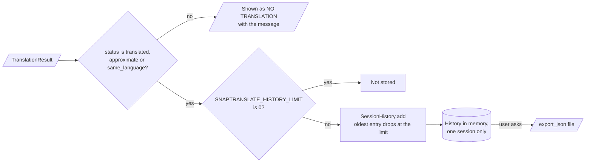

**Thresholds and limits**

| Setting | Value | Where |
|---|---|---|
| Glossary minimum coverage | 0.6 | `GlossaryTranslator.min_coverage` |
| Detector minimum letters | 3 | `BuiltinDetector.min_letters` |
| Detector minimum confidence | 0.5 | `BuiltinDetector.min_confidence` |
| OCR minimum image height | 600 pixels | `preprocess.upscale` |
| First-pass packs | `eng`, `deu`, `fra`, `spa`, `ita` | `ocr.FIRST_PASS_PACKS` |
| Model cache size | 4 (`SNAPTRANSLATE_MODEL_CACHE_SIZE`, 1 to 32) | `ModelCache` |
| History limit | 20 (`SNAPTRANSLATE_HISTORY_LIMIT`, 0 to 500) | `SessionHistory` |
| Bootstrap samples | 500 (`--n-boot`) | `benchmark.score_system` |

---

## 9. Data and file map

| Path | Committed? | Contents |
|---|---|---|
| `src/snaptranslate/data/testset.jsonl` | Yes | 36 synthetic sentence pairs |
| `src/snaptranslate/data/glossary.json` | Yes | Author-written travel glossary |
| `src/snaptranslate/data/langid_samples.json` | Yes | Detector training sentences |
| `data/README.md` | Yes | Test set format and FLORES-200 steps |
| `data/*` (other files) | No (git ignores it) | Your test sets |
| `*.png`, `*.jpg`, `*.jpeg`, `*.webp` | No (git ignores it) | Photos |
| `models/`, `outputs/`, `history/` | No (git ignores it) | Local artefacts and exports |
| `.env` | No (git ignores it) | Local settings and the LLM key |

---

## 10. How to run snaptranslate

### 10.1 Prerequisites

| Need | For |
|---|---|
| Python 3.11+ | All components |
| Tesseract and language packs (system packages) | Photos (`image` command, Photo tab) |
| Extra `ocr` | `pytesseract` and Pillow |
| Extra `mt` | MarianMT and NLLB-200 (large downloads) |
| Extra `ui` | Streamlit page |
| Extra `metrics` | `sacrebleu` cross-check |
| An OpenAI-compatible API key | Optional `llm` backend |

### 10.2 Installation

```bash
git clone https://github.com/KrishnaAnnavaram/snaptranslate.git
cd snaptranslate
python -m venv .venv
. .venv/bin/activate            # Windows: .venv\Scripts\activate
pip install -e ".[dev]"
```

### 10.3 Run snaptranslate

```bash
# Offline demo: glossary backend only, no key, no network
export SNAPTRANSLATE_BACKENDS=glossary
snaptranslate translate "Der Bahnhof ist heute geschlossen." --to en
snaptranslate translate "Wo ist der Bahnhof?" --to ja        # NO TRANSLATION (unsupported_pair)
snaptranslate detect "這是我們的國家"
snaptranslate languages
snaptranslate pairs --langs en,de,fr,zh
snaptranslate benchmark --condition all

# Neural backends and photos
pip install -e ".[mt,ocr]"
sudo apt-get install tesseract-ocr tesseract-ocr-deu tesseract-ocr-fra
export SNAPTRANSLATE_BACKENDS=marian,nllb,glossary
snaptranslate doctor
snaptranslate image sign.jpg --to en
snaptranslate benchmark --testset data/flores_de_en.jsonl

# Browser page, or the Docker image with Tesseract
pip install -e ".[ui,ocr]"
streamlit run src/snaptranslate/app/streamlit_app.py
docker build -t snaptranslate . && docker run -p 8501:8501 snaptranslate
```

The Streamlit page loads the shared parts once and keeps one history for each browser session:

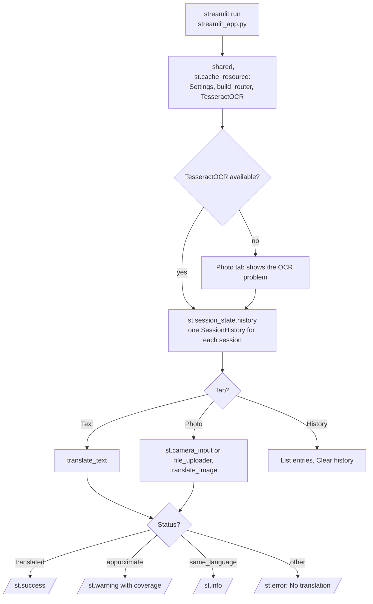

### 10.4 Environment variables

| Variable | Used by | Meaning |
|---|---|---|
| `SNAPTRANSLATE_BACKENDS` | router | Comma list in priority order, default `marian,nllb,llm,glossary` |
| `SNAPTRANSLATE_TARGET` | CLI, page | Default target language, default `en` |
| `SNAPTRANSLATE_TESSERACT_CMD` | OCR | Path to the Tesseract binary, if it is not on `PATH` |
| `SNAPTRANSLATE_MODEL_CACHE_SIZE` | model cache | Number of loaded models to keep, default 4 |
| `SNAPTRANSLATE_NLLB_MODEL` | `nllb` | Default `facebook/nllb-200-distilled-600M` |
| `SNAPTRANSLATE_LLM_BASE_URL` | `llm` | Base URL of an OpenAI-compatible API |
| `SNAPTRANSLATE_LLM_MODEL` | `llm` | Model name at that API |
| `SNAPTRANSLATE_LLM_API_KEY` | `llm` | API key (secret) |
| `SNAPTRANSLATE_HISTORY_LIMIT` | session history | Entries for each session, default 20, 0 turns history off |

Credentials are only in a local `.env` file. Git ignores this file. Do not print or commit credentials.

---

## 11. How to extend snaptranslate

| You want to… | Do this | Code change? |
|---|---|---|
| Add a Marian pair | Add the pair to `MARIAN_PAIRS` in `mt/neural.py` | Small |
| Add a language | Add a `Language` entry to `REGISTRY` with its pack and NLLB code | Small |
| Add a backend | Write a class with `name`, `available`, `supports`, `translate` and add it to `build_router` | Small |
| Change the backend order | Set `SNAPTRANSLATE_BACKENDS` | No |
| Use a real test set | Write FLORES-200 lines as JSONL (see `data/README.md`) and pass `--testset` | No |
| Add a glossary language | Add an entry to `glossary.json` | No (data only) |

---

## 12. Validation results

All numbers come from `snaptranslate benchmark --backends glossary --condition all` on the bundled synthetic test set. They are synthetic results.

| Validation | Result | Command |
|---|---|---|
| Unit tests (CI installs only `.[dev]`) | **75 passed, 1 skipped** (the `sacrebleu` cross-check needs the `metrics` extra) | `pytest -q` |
| Metric check | BLEU and chrF equal `sacrebleu` 2.x to 1e-6 on a fixed sample | `pytest tests/test_metrics_benchmark.py` with `sacrebleu` |
| Detector accuracy | **0.917** (33 of 36). Misses: 3 short signs (`Défense de fumer.`, `Prohibido fumar.`, `Entrada gratuita para niños.`) | `snaptranslate benchmark` |

**Benchmark, BLEU and chrF with 95 % bootstrap intervals (12 sentences for each pair)**

| System | Condition | Pair | Answered | BLEU | chrF |
|---|---|---|---|---|---|
| `glossary` | `clean` | de-en | 11 of 12 | 70.7 (43.2 to 94.3) | 79.4 (57.8 to 97.4) |
| `glossary` | `clean` | fr-en | 11 of 12 | 80.3 (54.7 to 100.0) | 83.3 (59.8 to 100.0) |
| `glossary` | `clean` | es-en | 11 of 12 | 81.9 (51.5 to 100.0) | 82.7 (57.4 to 100.0) |
| `glossary` | `ocr-eng` | de-en | 9 of 12 | 49.0 (19.7 to 71.9) | 60.8 (38.9 to 81.6) |
| `glossary` | `ocr-eng` | fr-en | 7 of 12 | 18.5 (5.4 to 28.8) | 35.8 (18.3 to 52.9) |
| `glossary` | `ocr-eng` | es-en | 10 of 12 | 35.1 (18.3 to 54.2) | 55.3 (35.6 to 72.3) |
| `copy-source` | `clean` | de-en, fr-en, es-en | 12 of 12 | 1.1 to 1.2 | 14.3 to 16.1 |

The `ocr-native` condition gives scores near the `clean` scores (de-en 70.7, fr-en 80.3, es-en 75.3 BLEU).

The glossary and the test set have the same author, so the `clean` scores are optimistic. They show that the benchmark works, not that the glossary is a good translator.

The difference between `clean` and `ocr-eng` is the useful result. Lost accents cut the chrF of the same backend by 18.6 to 47.5 points. This is the effect of the English-only OCR pack in the prototype, measured on synthetic noise.

The neural backends were not run in CI. There is no measured MarianMT or NLLB score in this README. The prototype reported BLEU, METEOR and ROUGE against a fixed sentence, so there is no prototype result to compare.

---

## 13. Known problems

Read these problems before you use snaptranslate in production.

| # | Area | Problem | Impact and action |
|---|---|---|---|
| 1 | Quality | No neural backend was scored in this repository | Run the benchmark on FLORES-200 with `marian` and `nllb` before you trust a backend |
| 2 | Glossary | The glossary is small and gives word-by-word output with the source word order | Use it only as an offline fallback. The status `approximate` tells the user |
| 3 | Detector | Short signs (2 to 4 words) can get the wrong Latin language | Select the source language in the page or with `--from` |
| 4 | OCR | The first pass reads only Latin packs | For Chinese, Japanese, Korean, Russian, Arabic or Hindi signs, select the source language |
| 5 | OCR | There is no deskew and no text-region detection | Photos at an angle give poor OCR. Take the photo straight on |
| 6 | Benchmark | The bundled test set has 36 sentences, so the intervals are wide | Use FLORES-200 for decisions |
| 7 | Metrics | No COMET score | Add COMET when a GPU is available |
| 8 | LLM | The LLM API receives the source text | Do not send private text to an external API. Prefer models that run on your computer |

---

## 14. Key points

1. **Each result has an honest status.** The user never sees the source text labelled as a translation.
2. **The OCR uses the pack of the source language.** A first pass finds the language when the user does not give it.
3. **One canonical code connects all tools.** `zh-cn`, `chi_sim` and `zho_Hans` all become `zh`.
4. **The benchmark scores against the reference of each sentence.** The metrics equal `sacrebleu` 2.x.
5. **The web app is safe to deploy.** There is no secret in code, no subprocess, no server camera and no shared history.
6. **Everything runs offline.** The demo, the benchmark and the 76 tests need no key and no network.

---

## 15. Glossary

| Term | Meaning |
|---|---|
| **Source text** | The text to translate, typed or read by OCR |
| **Canonical code** | The one code in `languages.py` for a language |
| **Language pack** | A Tesseract traineddata file, for example `deu` |
| **First pass** | The OCR read with Latin packs when the source language is not known |
| **Detector** | The component that gives a canonical code and a confidence to a text |
| **Backend** | One translator: `marian`, `nllb`, `llm` or `glossary` |
| **Router** | The component that selects the first available backend for a pair |
| **Pair** | A source language and a target language |
| **Status** | The label of a result, for example `translated` or `unsupported_pair` |
| **Approximate output** | Word-by-word glossary output with a coverage value |
| **Coverage** | The share of source words that the glossary knows |
| **Model cache** | The LRU store of loaded models |
| **Session history** | The bounded list of results of one session |
| **Test set** | Sentences with one reference translation each |
| **Reference** | The correct translation of one test sentence |
| **Condition** | The noise on the source text in a benchmark |
| **Baseline** | `CopySource`, the system that outputs the source text |
| **BLEU** | Corpus n-gram precision score with a brevity penalty (sacreBLEU defaults) |
| **chrF** | Character n-gram F-score with beta 2 |
| **CER** | Character error rate: edit distance divided by the reference length |

---

## 16. License

[MIT](LICENSE) © 2026 Krishna Annavaram
